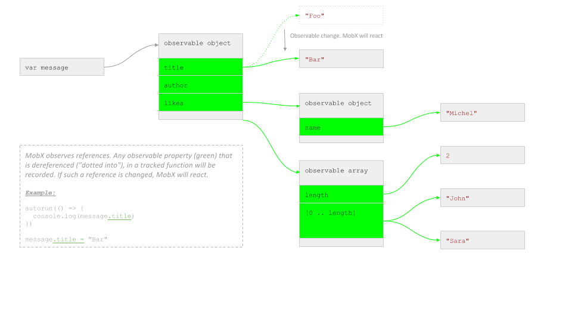

# MobX 何时才会响应 ?

通常MobX会和你预期想的响应是一致的。
可以说90%的场景mobx是正常运行的。
然而, 在一些情况下你会遇到和你期望不一样的结果。
在这些情况下，深入理解MobX如何确定要做出响应是非常值得的。

> 在读取任何跟踪函数执行中的 _存在_ **observable** _属性_ 时, MobX会做出响应。

* _"reading"_ is dereferencing an object's property, which can be done through "dotting into" it (eg. `user.name`) or using the bracket notation (eg. `user['name']`).
* _"trackable functions"_ are the expression of `computed`, the `render()` method of an observer component, and the functions that are passed as the first param to `when`, `reaction` and `autorun`.
* _"during"_ means that only those observables that are being read while the function is executing are tracked. It doesn't matter whether these values are used directly or indirectly by the tracked function.

换句话说, 下列情况 MobX 是不会做出响应的:
 * 从可观察值中获得值, 但是是在跟踪函数的外层。
 * 在异步调用的代码块中读取可观察者

## MobX 追踪的只是属性, 而非值

举了例子详细说明上述规则, 假设你有下面的observable的数据结构(`observable` 默认自身递归调用, 因此示例中的所有字段都是可观察的):

```javascript
let message = observable({
    title: "Foo",
    author: {
        name: "Michel"
    },
    likes: [
        "John", "Sara"
    ]
})
```

在内存中看起来如下。绿色框表示可观察的性质。请注意，值本身是不可观察的 ！



现在 MobX 基本上做的是记录你在你的函数中使用的 _箭头_ 。 之后, 只要其中任意一个箭头改变（当它们开始变成别的东西）, 它就会重新运行。

## 例子

让我们来具体看一些例子（基于上面定义的 `message` 变量）:

#### 正确: 在被跟踪函数内引用

```javascript
autorun(() => {
    console.log(message.title)
})
message.title = "Bar"
```

这会和预期一样, 属性 `.title` 在 autorun 中被引用, 并且在之后改变, 所以这个改变是可以检测到的。

你可以通过在跟踪函数内调用 `whyRun()` 去验证 MobX 将跟踪哪些属性。在上述功能的情况下，它将输出以下内容:

```javascript
autorun(() => {
    console.log(message.title)
    whyRun()
})

// Outputs:
WhyRun? reaction 'Autorun@1':
 * Status: [running]
 * This reaction will re-run if any of the following observables changes:
    ObservableObject@1.title
```

#### 错误: 改变一个非 observable 的引用

```javascript
autorun(() => {
    console.log(message.title)
})
message = observable({ title: "Bar" })
```

它将 **不会** 响应。`message` 虽然改变了, 但是 `message` 并不是可观察的, 其只是一个引用 observable 的变量。


#### 错误: 在跟踪函数外进行间接引用

```javascript
var title = message.title;
autorun(() => {
    console.log(title)
})
message.title = "Bar"
```

This will **not** react. `message.title` was dereferenced outside the `autorun`, and just contains the value of `message.title` at the  moment of dereferencing (the string `"Foo"`).
`title` is not an observable so `autorun` will never react.

它将 **不会** 响应。`message.title` 是在 `autorun` 外面的间接引用, 在引用的时候 `title` 变量只是 `message.title` 的值(字符串 `Foo`)。
`title` 并不是 `observable` 的，所以 `autorun` 永远不会作出相应。

#### 正确: 在跟踪函数内进行间接引用

```javascript
autorun(() => {
    console.log(message.author.name)
})
message.author.name = "Sara";
message.author = { name: "John" };
```

这两个更改都将作出相应。 `author` 和 `author.name` 都是通过 `.` 访问的，使得 MobX 可以跟踪这些引用。

#### 错误: 存储 `observable` 对象的本地引用而不对其跟踪

```javascript
const author = message.author;
autorun(() => {
    console.log(author.name)
})
message.author.name = "Sara";
message.author = { name: "John" };
```

第一个更改将会作出相应，`message.author` 和 `author` 是同一个对象，而 `name` 属性在 `autorun` 中进行的间接引用。
但是第二个更改并不会响应，`message.author` 的关系没有通过 `autorun` 追踪。Autorun 仍然使用的是"老"的 `author`。

#### 正确: 在跟踪函数内访问数组属性


```javascript
autorun(() => {
    console.log(message.likes.length);
})
message.likes.push("Jennifer");
```

其会和预期一样。`.length` 指向一个属性。
注意这会对数组中的 *任何* 更改做出响应。
数组不追踪每个 索引 / 属性 (如 observable 对象和maps)，而是作为一个整体追踪。

#### 错误: 在跟踪函数内索引超界访问

```javascript
autorun(() => {
    console.log(message.likes[0]);
})
message.likes.push("Jennifer");
```

This will react with the above sample data, array indexers count as property access. But **only** if the provided `index < length`.
MobX will not track not-yet-existing indices or object properties (except when using maps).
So always guard your array index based access with a `.length` check.

上面的例子数据是会作出响应，数组的索引计数作为属性访问，但前提条件 `必须` 是提供的 **索引小于数组长度**。
MobX 不会追踪还不存在的索引或者对象属性(除使用 `maps` 外)。
所以建议总是使用 `.length` 来检查保护基于数组索引的访问。

#### 正确: 在跟踪函数内使用数组方法

```javascript
autorun(() => {
    console.log(message.likes.join(", "));
})
message.likes.push("Jennifer");
```

其会和预期一样响应。所有不会改变数组的数组方法都会自动地跟踪。

---

```javascript
autorun(() => {
    console.log(message.likes.join(", "));
})
message.likes[2] = "Jennifer";
```

这也会预期一样响应。所有数组的索引分配都可以检测到，但 **只有** 索引小于数组长度时。

#### 错误: "使用" observable 但没有访问它的任何属性

```javascript
autorun(() => {
    message.likes;
})
message.likes.push("Jennifer");
```

这将不会作出响应。因为 `likes` 数组本身并没有被 `autorun` 使用，只是引用了数组。
所以相比之下，`messages.likes = ["Jennifer"]` 是会作出响应的; 声明表达式并没有修改数组，而是修改了 `likes` 属性本身。

#### 错误: 使用非 observable 的属性


```javascript
autorun(() => {
    console.log(message.postDate)
})
message.postDate = new Date()
```

这将不会作出响应。MobX 只能追踪 observable 的属性。

#### 错误: 使用还不存在的 observable 对象

```javascript
autorun(() => {
    console.log(message.postDate)
})
extendObservable(message, {
    postDate: new Date()
})
```

This will **not** react. MobX will not react to observable properties that did not exist when tracking started.
If the two statements are swapped, or if any other observable causes the `autorun` to re-run, the `autorun` will start tracking the `postDate` as well.

其不会作出响应。MobX 不会对当追踪开始时还不能存在的 observable 属性作出响应。
如果两个表达式交换下顺序，或者任何其它的可观察属性使 `autorun` 再次运行的话，`autorun` 也会开始追踪 `postDate` 属性。

#### 正确: 使用 map 中还不能存在的条目

```javascript
const twitterUrls = observable(asMap({
    "John": "twitter.com/johnny"
}))

autorun(() => {
    console.log(twitterUrls.get("Sara"))
})
twitterUrls.set("Sara", "twitter.com/horsejs")
```

这将会作出响应。Observable maps 支持观察还不存在的条目。
注意这里最开始会输出 `undefined`。
可以通过使用 `twitterUrls.has("Sara")` 来先检查该项是否存在。
所以对于动态键对，请总是使用 observable maps。

## MobX 只能跟踪同步访问的数据

```javascript
function upperCaseAuthorName(author) {
    const baseName = author.name;
    return baseName.toUpperCase();
}
autorun(() => {
    console.log(upperCaseAuthorName(message.author))
})
message.author.name = "Chesterton"
```

这将会作出响应。尽管 `author.name` 不是在 `autorun` 自身中进行的间接引用。
MobX 会跟踪发生在 `upperCaseAuthorName` 函数里的间接引用，
因为它是在 autorun _执行_ 期间发生的。

----

```javascript
autorun(() => {
    setTimeout(
        () => console.log(message.likes.join(", ")),
        10
    )
})
message.likes.push("Jennifer");
```

这将不会作出响应, 在 `autorun` 执行期间没有直接访问 可观察的值，其只在 `setTimeout` 执行期间访问了。
通常来说，这是相当明显的，很少会导致问题。
这里需要注意的是将可渲染的回调传递给 React 组件，例如下面的示例:

```javascript
const MyComponent = observer(({ message }) =>
    <SomeContainer
        title = {() => <div>{message.title}</div>}
    />
)

message.title = "Bar"
```

一眼看上去是ok的，除了 `<div>` 实际上不是由 `MyComponent` (有追踪的渲染) 渲染的，而是 `SomeContainer`。
所以要确保 `SomeContainer` 的 title 可以正确对新的 `message.title` 作出响应，`SomeContainer` 应该也是一个 `observer`。
如果 `SomeContainer` 来自外部库，你也可以通过在自己的无状态 `observer` 组件中包装 `div` 来解决这个问题，并在回调中实例化:

```javascript
const MyComponent = observer(({ message }) =>
    <SomeContainer
        title = {() => <TitleRenderer message={message} />}
    />
)

const TitleRenderer = observer(({ message }) =>
    <div>{message.title}</div>}
)

message.title = "Bar"
```

## 避免在本地字段变量中缓存 observables

一个常见的错误就是把间接引用的可观察变量存储到本地变量，然后认为组件会作出响应。举例来说:

```javascript
@observer class MyComponent extends React.component {
    author;
    constructor(props) {
        super(props)
        this.author = props.message.author;
    }

    render() {
        return <div>{author.name}</div>
    }
}
```

这个组件会对 `author.name` 的变化作出响应，但不会对 `message` 自身的 `.author` 的变化作出响应！因为这个间接引用发生在 `render()` 之外，`render()` 是 `observer` 组件的唯一跟踪函数。
注意一点即便把组件的 `author` 字段标记为 `@observable` 的字段也不能解决问题，`author` 仍然是只分配一次。
这个问题在 `render()` 中进行间接引用或者在组件实例上引入一个计算属性解决:


```javascript
@observer class MyComponent extends React.component {
    @computed get author() {
        return this.props.message.author
    }
// ...
```

## 多组件将如何渲染

假设我们使用下面的组件来渲染上面的 `message` 对象。

```javascript
const Message = observer(({ message }) =>
    <div>
        {message.title}
        <Author author={ message.author } />
        <Likes likes={ message.likes } />
    </div>
)

const Author = observer(({ author }) =>
    <span>{author.name}</span>
)

const Likes = observer(({ likes }) =>
    <ul>
        {likes.map(like =>
            <li>{like}</li>
        )}
    </ul>
)
```

| change | re-rendering component |
| --- | --- |
| `message.title = "Bar"` | `Message` |
| `message.author.name = "Susan"` | `Author` (`.author` is dereferenced in `Message`, but didn't change)* |
| `message.author = { name: "Susan"}` | `Message`, `Author` |
| `message.likes[0] = "Michel"` | `Likes` |

编注:
1. \* 如果 `Author` 组件是像这样调用的: `<Author author={ message.author.name} />` 。`Message` 会是进行间接引用的组件并对 `message.author.name` 的改变作出响应。尽管如此，`<Author>` 同样会重新渲染，因为它接收到了一个新的值。所以从性能上考虑，越晚进行间接引用越好。
2. \** 如果 `likes` 数组里面的是对象而不是字符串，并且它们在它们自己的 `Like` 组件中渲染，那么对于发生在某个具体的 `like` 中发生的变化，`Likes` 组件将不会重新渲染.

## TL;DR

> MobX 会对在跟踪函数执行期间读取的任何 _包含_ **observable** 的属性做出响应。